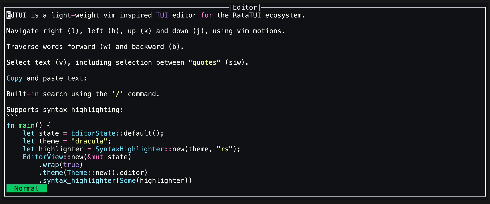

### `EdTUI`

<div align="center">

[](https://github.com/preiter93/edtui/actions/workflows/ci.yml)

</div>

#### Overview
`EdTUI` is a text editor widget for the [Ratatui](https://github.com/ratatui-org/ratatui) ecosystem.
It is designed to provide a light-weight user experience inspired by Vim.

```rust
use edtui::{EditorState, EditorTheme, EditorView};
use ratatui::widgets::Widget;

let mut state = EditorState::default();
EditorView::new(&mut state)
        .theme(EditorTheme::default())
        .wrap(true) // line wrapping
        .render(area, buf);
```

### Features
- Vim-like keybindings and editing modes for efficient text manipulation.
- Copy paste using the systems clipboard.
- Line wrapping.
- Syntax highlighting (experimental).
- Mouse support (experimental).

### Demo



### Keybindings
`EdTUI` offers a set of keybindings similar to Vim. Here are some of the most common keybindings:

##### Normal/Visual Mode:

| Keybinding              | Description                                  |
|-------------------------|----------------------------------------------|
| `i`                     | Enter Insert mode                            |
| `v`                     | Enter Visual mode                            |
| `h`, `j`, `k`, `l`      | Navigate left, down, up, and right           |
| `w`, `b`                | Move forward or backward by word             |
| `x`                     | Delete the character under the cursor        |
| `u`, `<ctrl>+r`         | Undo/Redo last action                        |
| `Esc`                   | Escape Visual mode                           |
| `0`                     | Move cursor to start of line                 |
| `^`                     | Move cursor to first non-blank character     |
| `$`                     | Move cursor to end of line                   |
| `gg`                    | Move cursor to the first row                 |
| `G `                    | Move cursor to the last row                  |
| `%`                     | Move cursor to closing/opening bracket       |
| `a`                     | Append after the cursor                      |
| `A`                     | Append at the end of the line                |
| `o`                     | Add a new line below and enter Insert mode   |
| `O`                     | Add a new line above and enter Insert mode   |
| `d`                     | Delete the selection                         |
| `dd`                    | Delete the current line                      |
| `D`                     | Delete to the end of the line                |
| `ciw`                   | Select between delimiters. Supported: [`"`]  |
| `ci` + ",',(,[ or {     | Select between delimiter ",',(,[,{           |
| `u`                     | Undo the last change                         |
| `r`                     | Redo the last undone action                  |
| `y`                     | Copy the selected text                       |
| `p`                     | Paste the copied text                        |

##### Insert Mode:

| Keybinding  | Description                             |
|-------------|-----------------------------------------|
| `Esc`       | Return to Normal mode                   |
| `Backspace` | Delete the previous character                |
| `Enter`     | Insert line break                       |
| `Arrows`    | Navigation                              |

For more keybindings and customization options, refer to the code.

### Experimental Mouse Support

`Edtui` includes experimental mouse support:
```rust
let event_handler = EditorEvent::default();
event_handler.on_mouse_event(mouse_event, &mut state);
```

**Note**: This feature is experimental, so expect potential bugs and breaking changes. It does
currently not work correctly on wrapped lines.

### Syntax highlighting

Syntax highlighting was added in version `0.8.4`. It is experimental, so expect breaking changes.

`Edtui` offers a number of custom themes, see [`SyntaxHighlighter::theme`] for a complete list.
If you want to use a custom theme, see [`SyntaxHighlighter::custom_theme`]. Check [syntect](https://github.com/trishume/syntect)
for more details about themes and extensions.

```rust
use edtui::EditorState;
use edtui::EditorView;
use edtui::SyntaxHighlighter;

let theme_name = "dracula";
let extension = "rs";
let syntax_highlighter = SyntaxHighlighter::new(theme_name, extension);
EditorView::new(&mut EditorState::default())
        .syntax_highlighter(Some(syntax_highlighter))
        .render(area, buf);
```


#### Roadmap
- [ ] Support termwiz and termion
- [ ] Display line numbers
- [ ] Remap keybindings

License: MIT
